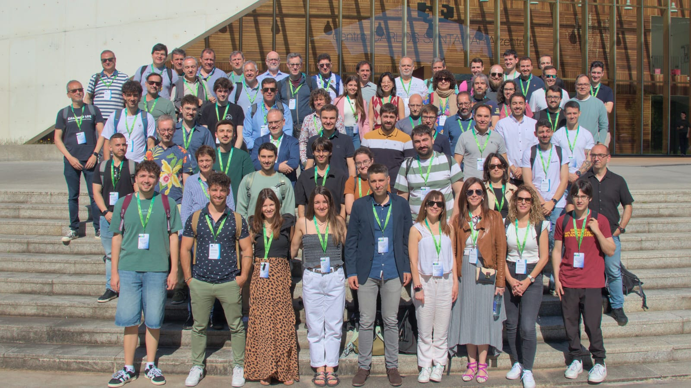
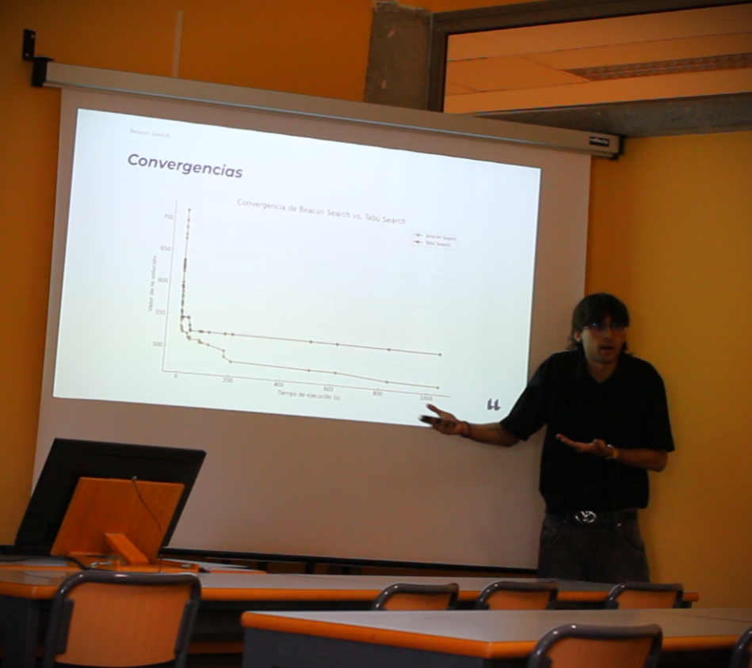
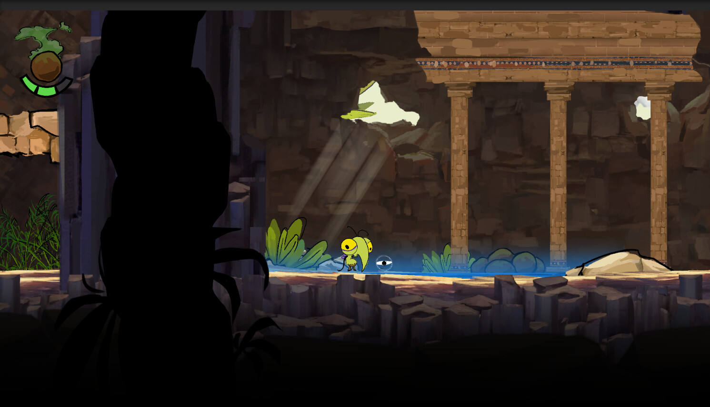
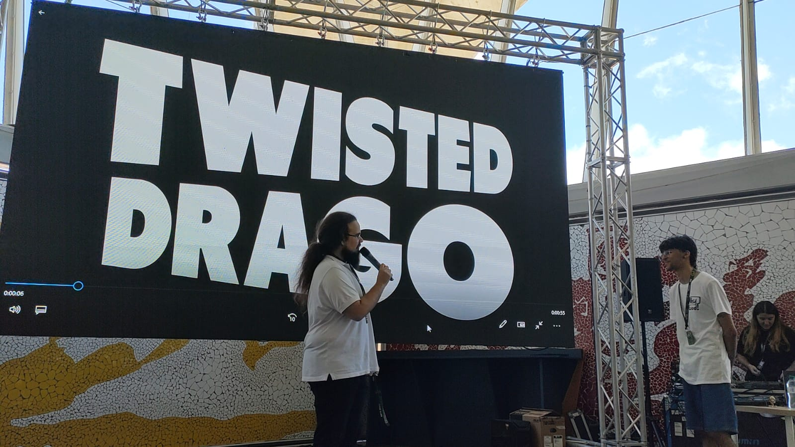
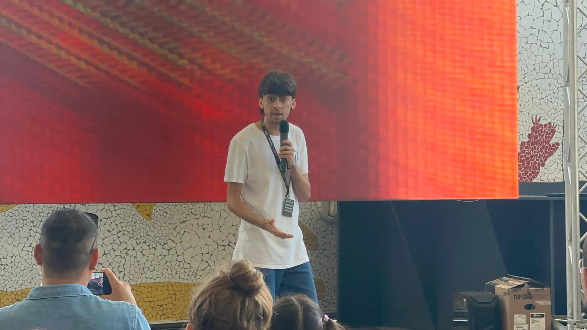
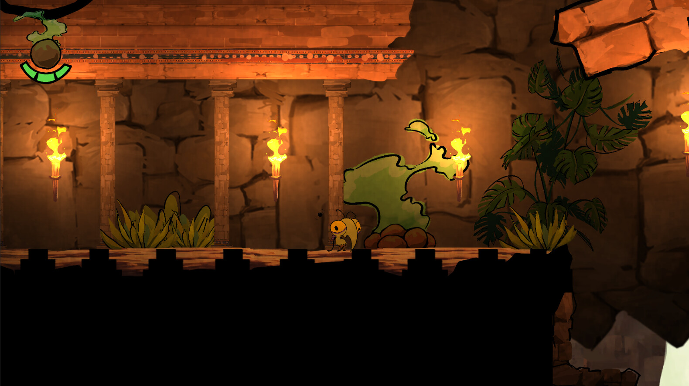
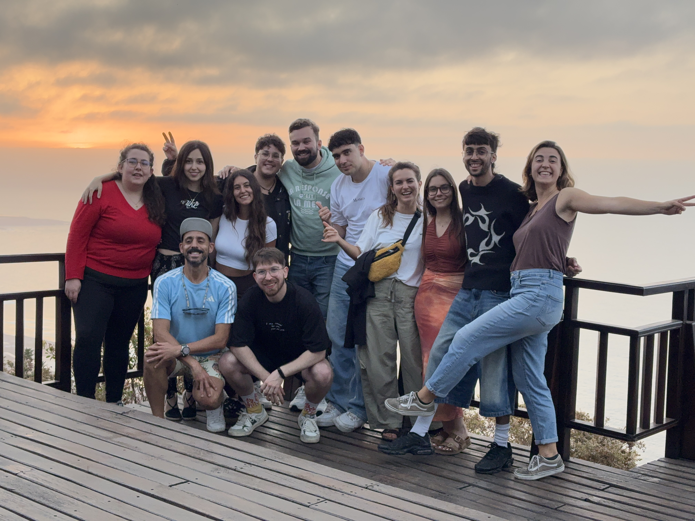
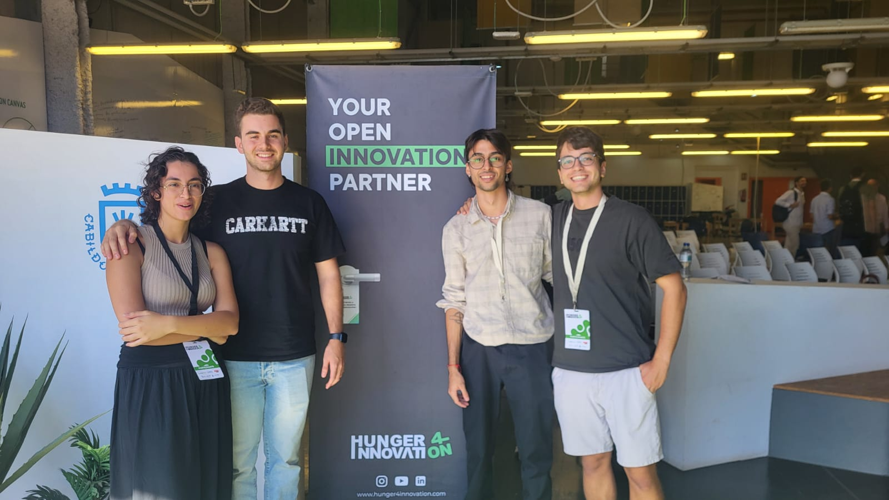

# 👋 Hi! I'm Juan Aday Siverio González

🎓 Computer Science graduate from the University of La Laguna  
🧠 Passionate about knowledge, artificial intelligence, and combinatorial optimization  
🎮 Creative director and lead developer of *Why God?* (published on Steam)  
🔬 Active researcher in complex problems like SCC-VRP and CDSP  
🚀 My mission: to use technology to transform the world, not just optimize it

---

## 🧪 Research & Development

- 📌 **SCC-VRP**: Surpassed the state of the art; currently working on a scientific publication.
- 🧠 **CDSP**: Developed innovative approaches to the Cross-Dock Scheduling Problem.
- 🎤 **MAEB**: Speaker at the Spanish Conference on Metaheuristics, Evolutionary and Bioinspired Algorithms.
- 🧩 **Cesinf**: Presenter at university events on algorithms, AI, and video game development.

<table style="width: 100%; table-layout: fixed;">
  <tr>
    <td style="width: 33%; text-align: center; vertical-align: top;">
      

        
        <b>Cesinf</b>
      

    </td>
    <td style="width: 33%; text-align: center; vertical-align: top;">
      

        
        <b>MAEB</b>
      

    </td>
    <td style="width: 33%; text-align: center; vertical-align: top;">
      

        
        <b>SCC-VRP</b>
      

    </td>
  </tr>
</table>

---

## 💼 Professional Experience

- 👨‍🏫 **Instructor** with 3+ years teaching from computational logic to applied software development.
- 🎮 **Twisted Drago**: Founder and creative director. Led a 15-person team on *Why God?*
    - Presented *Why God?* at Tenerife GG (TGG), showcasing the game to the indie dev community.
- 💻 **Kaizten Analytics**: Full-Stack Developer (Java, Spring Boot, Vue.js, TypeScript, MongoDB).

<table width="100%">
  <tr>
    <td width="50%" align="center">
       
      <b>Why God? - Videogame</b>
    </td>
    <td width="50%" align="center">
       
      <b>TGG Presentation</b>
    </td>
  </tr>
  <tr>
    <td width="50%" align="center">
       
      <b>TGG Presentation</b>
    </td>
    <td width="50%" align="center">
       
      <b>Why God? - Videogame</b>
    </td>
  </tr>
</table>

---

## ⚡ Events & Challenges

- 🧠 **Hunger for Innovation**: 24-hour competition solving real-world business challenges.
- 🌍 **Pueblos Remotos**: Tech-driven collaboration to solve real problems in rural communities in northern Tenerife.

<table style="width: 100%; table-layout: fixed;">
  <tr>
    <td style="width: 50%; text-align: center; vertical-align: top;">
      

        
        <b>Pueblos Remotos</b>
      

    </td>
    <td style="width: 50%; text-align: center; vertical-align: top;">
      

        
        <b>Hunger for Innovation</b>
      

    </td>
  </tr>
</table>

---

## 🎯 Motivation

Knowledge is not just a tool — it's a vital need.  
I aim to join environments where **AI and critical thinking** are valued as engines of change.  
I want to keep learning, building, and improving the world through code.

---

## 🛠️ Technologies & Tools

### 💻 Languages

### 🧰 Frameworks & Tools

### 🧠 Expertise
`Metaheuristics` • `Combinatorial Optimization` • `Hexagonal Architecture` • `AI` • `Game Design`
---

### ☎️ Links
)
)
---

📫 *Interested in collaborating? I'm always open to new challenges and impactful ideas.*
